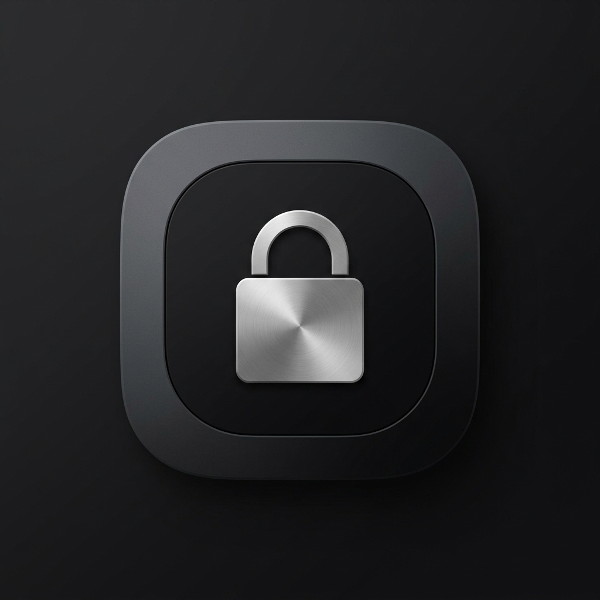

# 🛡️ One UI App Locker for Android

<p align="center">
  
</p>

<p align="center">
  <strong>An ultra-fast, zero-latency (0 ms) Android app locker crafted with Samsung One UI 6 & 7 design principles, Clean Architecture + MVVM, and Jetpack Compose.</strong>
</p>

<p align="center">
  <a href="README.md">🇹🇷 <b>Türkçe</b></a> &nbsp;•&nbsp; <a href="README.en.md">🇬🇧 <b>English</b></a>
</p>

<p align="center">
  
  
  
  
  
</p>

---

## 🌟 Key Features

### 1. 🎨 Authentic Samsung One UI Experience
- **Viewing Area & Interaction Area:** Spacious informative header on top; one-hand friendly interaction area at the bottom.
- **Squircle Card Design:** One UI signature `26.dp` rounded corner cards and containers.
- **Physics-Based Spring Animated Switch:** Ultra-smooth, tactile One UI toggle switches.
- **Dynamic Theme Engine:**
  - **System Default:** Automatically follows system Dark/Light mode.
  - **Light Mode & Dark Mode (One UI Dark):** Manual selection.
  - **True AMOLED Black:** Pure black backgrounds for OLED displays and maximum battery savings.
- **Hardware Refresh Rate Synchronization:** Syncs with device display panels (90Hz / 120Hz / 144Hz) to eliminate stutter and micro-lag.
- **Discreet Adaptive Icon:** Brushed titanium silver lock icon on a matte anthracite-black background.

### 2. ⚡ Zero Latency (0-Latency) & Natural Task Stack
- **`AppLockAccessibilityService`:** Listens to window state transitions (`TYPE_WINDOW_STATE_CHANGED`) at the system level; intercepts before protected apps render on screen.
- **In-Memory State Management (`AppLockStateHolder`):** Queries locked applications and temporary unlocked sessions in $O(1)$ memory time; zero main-thread or database bottlenecks.
- **Accurate App Routing:** Unlocking invokes `finish()`, naturally resuming the exact underlying activity (Gemini, specific WhatsApp chat, or YouTube video) without redirection anomalies.
- **Fallback Protection:** Battery-friendly `UsageStatsManager` service automatically engages if accessibility service is inactive.

### 3. 🔒 Advanced Security & Privacy
- **Dual Lock Modes (PIN & Pattern):**
  - **4-Digit PIN:** One UI numeric keypad with haptic error feedback.
  - **Smart Pattern Lock:** 3x3 pattern lock with intermediate dot bridging (collinear auto-connections) and 120 FPS gesture rendering.
- **Password Recovery & Reset:** Reset forgotten PIN/Pattern using salted SHA-256 security questions or biometric verification.
- **Recent Apps Privacy (`FLAG_SECURE`):** Completely blanks app content in Task Switcher and prevents screen captures.
- **Task Switcher Protection:** Active unlocked sessions are revoked immediately upon switching tasks; returning prompts for authentication.
- **Flexible Relock Policies:**
  - *Immediately (upon exiting the app)*
  - *When screen turns off*
  - *After 1 minute*
  - *After 5 minutes*
- **Android KeyStore & Biometrics:** Cryptographic security and `BiometricPrompt` supporting Fingerprint & Face Unlock.

---

## 🏗️ Architecture & Project Structure

The project strictly follows **Clean Architecture** principles and Separation of Concerns:

```
OneUi_applocker/
├── app/
│   ├── src/main/
│   │   ├── AndroidManifest.xml
│   │   ├── res/
│   │   │   ├── drawable/               # One UI vector icons & adaptive launcher
│   │   │   ├── values/                 # strings.xml, colors.xml, themes.xml
│   │   │   └── xml/                    # Accessibility & backup configurations
│   │   └── java/com/oneui/applocker/
│   │       ├── AppLockerApp.kt         # Application class & dependency container
│   │       ├── core/
│   │       │   ├── theme/              # Color, Shape, Type, OneUiAppLockerTheme
│   │       │   ├── designsystem/       # OneUiHeader, OneUiCard, OneUiSwitch, OneUiPatternLockView
│   │       │   ├── security/           # SecurityManager, BiometricHelper, AppLockStateHolder
│   │       │   └── permission/         # PermissionHelper, PermissionType
│   │       ├── data/
│   │       │   ├── model/              # AppItem, LockSettings, ThemeMode, RelockPolicy
│   │       │   ├── database/           # Room DB: AppDatabase, LockedAppDao, LockedAppEntity
│   │       │   └── repository/         # AppRepository, SettingsRepository (DataStore)
│   │       ├── service/
│   │       │   ├── AppLockAccessibilityService.kt   # Zero-latency event listener
│   │       │   ├── AppMonitorForegroundService.kt   # Fallback background guardian
│   │       │   └── BootCompletedReceiver.kt         # Auto-starter on device boot
│   │       └── ui/
│   │           ├── MainActivity.kt     # Main entry activity & navigation host
│   │           ├── navigation/         # AppNavHost, Screen routes
│   │           ├── home/               # App list, search, category filters, quick toggle
│   │           ├── lock/               # Lock screen (PIN, Pattern, Biometrics, Forgot Password)
│   │           ├── permissions/        # Step-by-step permissions wizard
│   │           ├── settings/           # Lock type, credential reset, recovery, theme
│   │           └── setup/              # First-time & update master key (PIN/Pattern/Recovery)
```

## 📄 License

This project is licensed under the [MIT License](LICENSE).
